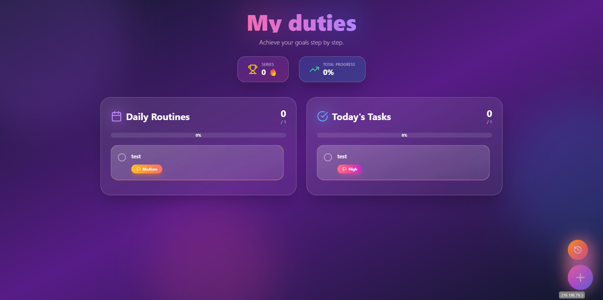
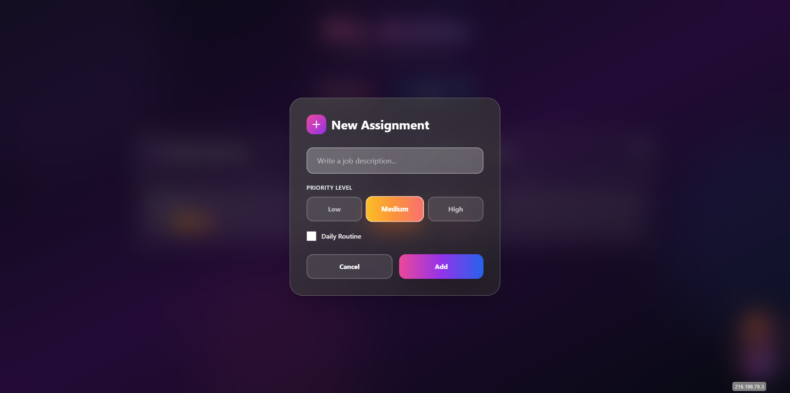
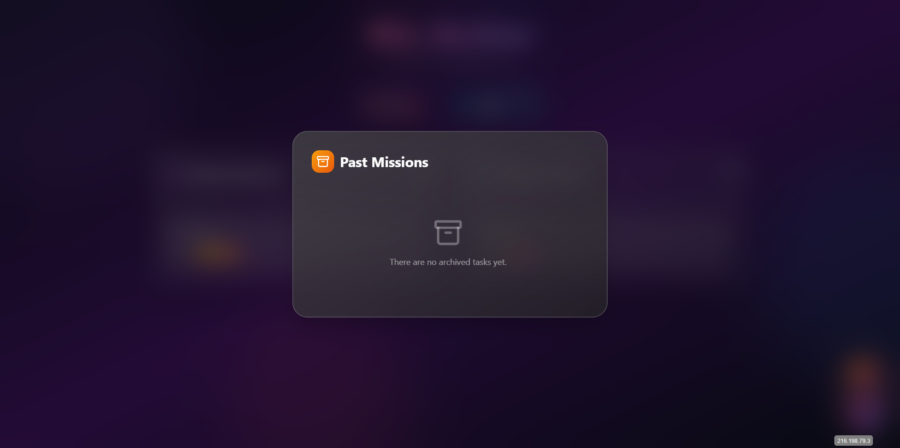

# todo-app

    

## 📑 Table of Contents

- [Description](#description)
- [Tech Stack](#tech-stack)
- [Quick Start](#quick-start)
- [Key Dependencies](#key-dependencies)
- [Run Commands](#run-commands)
- [Screenshots](#screenshots)
- [Project Structure](#project-structure)
- [Development Setup](#development-setup)
- [Contributing](#contributing)

## 📝 Description

A sleek and efficient task management application built with React and TypeScript. This todo-app provides a robust user experience for organizing daily tasks, featuring a type-safe architecture to ensure reliability and performance. Designed with modern web standards, it offers a clean interface for adding, tracking, and managing your to-do list effectively.

## 🛠️ Tech Stack

- ⚛️ React
- 📜 TypeScript

## ⚡ Quick Start

```bash

# Clone the repository
git clone https://github.com/M-K-B-61/todo-app.git

# Install dependencies
npm install

# Start development server
npm run dev
```

## 📦 Key Dependencies

```
@supabase/supabase-js: ^2.57.4
lucide-react: ^0.344.0
react: ^18.3.1
react-dom: ^18.3.1
```

## 🚀 Run Commands

- **dev**: `npm run dev`
- **build**: `npm run build`
- **lint**: `npm run lint`
- **preview**: `npm run preview`
- **typecheck**: `npm run typecheck`

## 📸 Screenshots

<p align="center">
  
</p>

<p align="center">
  
</p>

<p align="center">
  
</p>

## 📁 Project Structure

```
.
├── .bolt
│   ├── config.json
│   └── prompt
├── eslint.config.js
├── index.html
├── package.json
├── postcss.config.js
├── src
│   ├── App.tsx
│   ├── index.css
│   ├── main.tsx
│   └── vite-env.d.ts
├── tailwind.config.js
├── tsconfig.app.json
├── tsconfig.json
├── tsconfig.node.json
└── vite.config.ts
```

## 🛠️ Development Setup

### Node.js/JavaScript Setup
1. Install Node.js (v18+ recommended)
2. Install dependencies: `npm install` or `yarn install`
3. Start development server: (Check scripts in `package.json`, e.g., `npm run dev`)

## 👥 Contributing

Contributions are welcome! Here's how you can help:

1. **Fork** the repository
2. **Clone** your fork: `git clone https://github.com/M-K-B-61/todo-app.git`
3. **Create** a new branch: `git checkout -b feature/your-feature`
4. **Commit** your changes: `git commit -am 'Add some feature'`
5. **Push** to your branch: `git push origin feature/your-feature`
6. **Open** a pull request

Please ensure your code follows the project's style guidelines and includes tests where applicable.

---
*This README was generated with ❤️ by [ReadmeBuddy](https://readmebuddy.com)*
